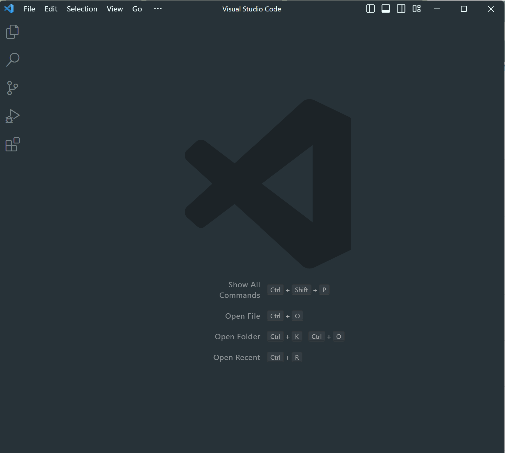

# Lab Report 1

## Part 1: Finding Your CSE15L Account

Use this [link](https://sdacs.ucsd.edu/~icc/index.php) to lookup your course-specific account for CSE 15L. Type in your username and student ID. After entering those fields, you should see a section called "Additional Accounts" with an account "cs15lsp23zz" where "zz" is replaced by the specific letters for your username. 


Since this is your first time logging in, you'll need to set a new password for your CSE15L account. Follow [this tutorial](https://drive.google.com/file/d/17IDZn8Qq7Q0RkYMxdiIR0o6HJ3B5YqSW/view) to reset your password.


## Part 2: Installing Visual Studio Code

To install Visual Studio Code, go to their website at https://code.visualstudio.com/. Follow the instructions to download Visual Studio Code for your operating system.
Once successfully installed, you should be able to open Visual Studio Code and see a page that looks similar to this. 



## Part 3: Remotely Connecting

If you're using Windows, you'll first need to download Git at https://gitforwindows.org/. Once that is installed, you'll need to set your default terminal in Visual Studio Code to use Git Bash.

1. Open Visual Studio Code and press [Ctrl] + [ ` ] to open a terminal. 
2. Open the command palette with [Ctrl] + [Shift] + [P]. Type "Select Default Profile" into the search bar and select Git Bash from the options.
3. Click on the + icon in the terminal window to open a new terminal that uses Git Bash.

Once you have a Git Bash terminal open, you can use ssh through this command:
`$ ssh cs15lsp23zz@ieng6.ucsd.edu` where `zz` is replaced by the letters in your course-specific account username.
Since this is your first time remotely connecting to this server, when you run the code you may get a message like this:
```
The authenticity of host 'ieng6.ucsd.edu (128.54.70.227)' can't be established.
RSA key fingerprint is SHA256:ksruYwhnYH+sySHnHAtLUHngrPEyZTDl/1x99wUQcec.
Are you sure you want to continue connecting (yes/no/[fingerprint])?
```

Type `yes` and press enter. The terminal should ask you to enter your password. When you type your password, the letters may not appear because the terminal wants to hide the password (similar to how passwords show up as dots on other websites). After you've entered your password, you should see a message like this:
```
# Now on remote server
Last login: Sun Jan  2 14:03:05 2022 from 107-217-10-235.lightspeed.sndgca.sbcglobal.net
quota: No filesystem specified.
Hello cs15lsp23zz, you are currently logged into ieng6-203.ucsd.edu

You are using 0% CPU on this system

Cluster Status 
Hostname     Time    #Users  Load  Averages  
ieng6-201   23:25:01   0  0.08,  0.17,  0.11
ieng6-202   23:25:01   1  0.09,  0.15,  0.11
ieng6-203   23:25:01   1  0.08,  0.15,  0.11

Sun Jan 02, 2022 11:28pm - Prepping cs15lsp23
```

This means that you have successfully remotely connected to the server!

## Part 4: Running Some Commands

