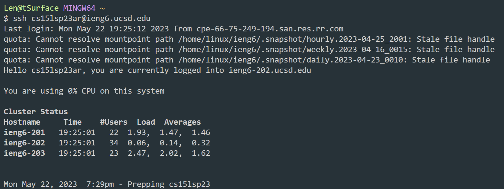
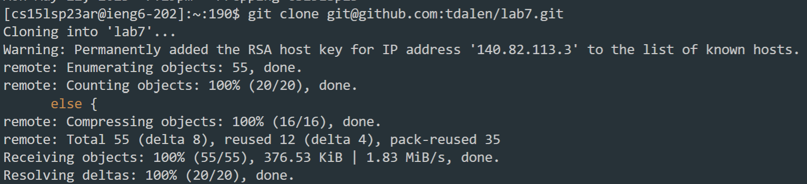
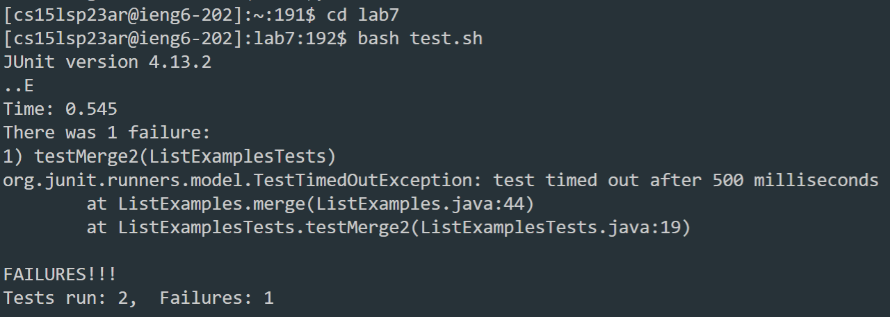
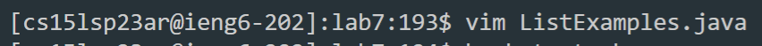
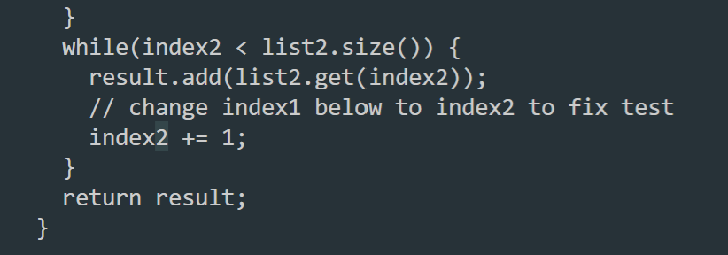
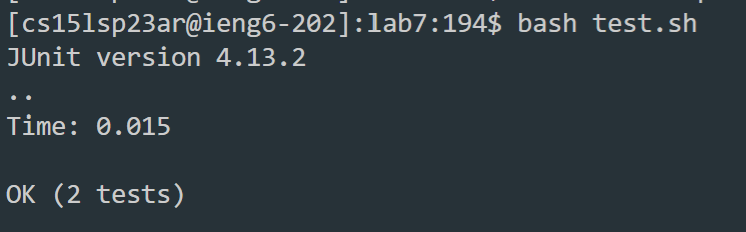
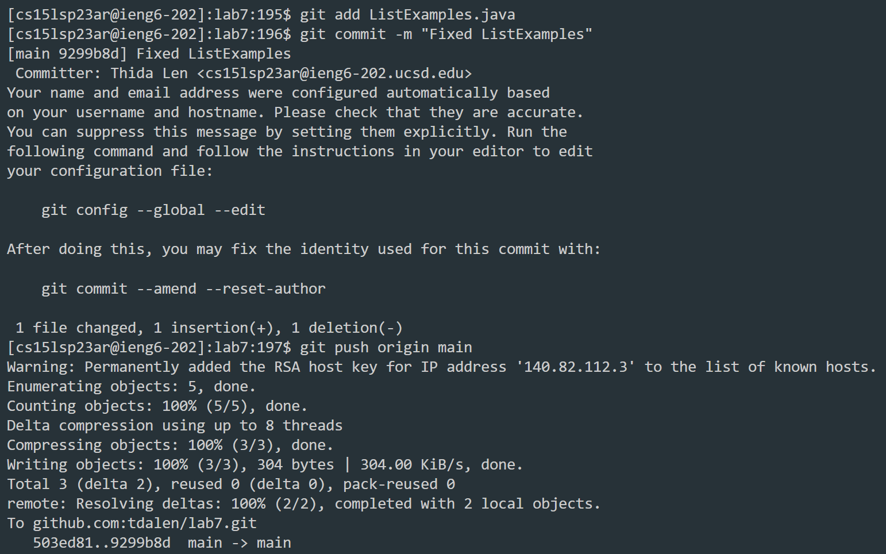

# Lab Report 4
**1. Log into ieng6.**

```
<Ctrl><R>, ss, <Enter>
```
Since the `ssh` command with my account was in my history, I used `<Ctrl><R>` to open the history and searched `ss` to get the right command.

**2. Clone your fork of the repository from your Github account.**

```
$ git clone <Ctrl><V>
```
I copied the SSH URL to my fork of the repository from the web, and pasted this as the argument for the `git clone` command.

**3. Run the tests, demonstrating that they fail.**

```
$ cd lab7
$ bash t <Tab> <Enter>
```
I changed the directory to the cloned repository, typed `bash t`, and used `<Tab>` to autofill `test.sh` and ran the command. 

**4. Edit the code file to fix the failing test.**


```
$ vim ListExamples.java
/index1, <Enter>, n, n, n, n, n, n, n, n, n, <Right>, <Right>, <Right>, <Right>, x, i, 2
<Esc>, :wq, <Enter>
```
I ran `vim ListExamples.java` to edit the file. I did a search for `index1` and went to the next occurrence of it until finding the correct one that needed to be changed. I moved to place my cursor on the `1` and used `x` to delete the character, `i` to enter insert mode, and `2` to change it to `index2`. After making this change, I used `<Esc>` to go back into normal mode, and ran `:wq` to save and exit the vim editor.

**5. Run the tests, demonstrating that they now succeed.**

```
<Ctrl><R>, ba, <Enter>
```
I searched `ba` in my history for the command `bash test.sh` that I previously ran, and ran the tests again.

**6. Commit and push the resulting change to your Github account.**

```
$ git add Li <Tab> .java <Enter>
$ git com <Tab> -m "Fixed ListExamples"
$ git push origin main
```
I typed in most of these commands manually, but used `<Tab>` to autocomplete `ListExamples` and the `commit` command.
