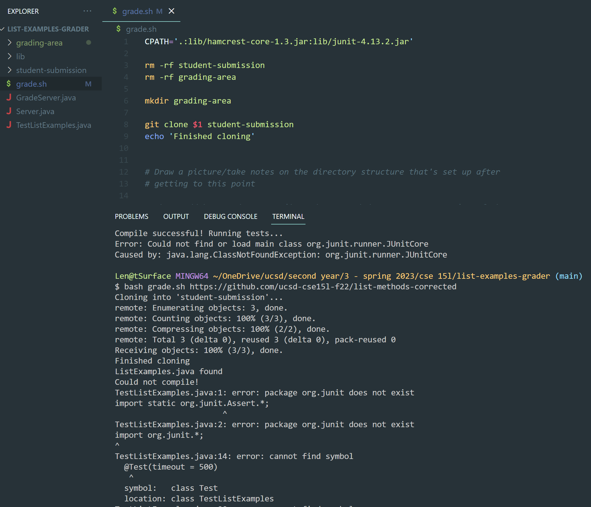

# Lab Report 5
**Student:**

I'm trying to test my grade.sh file against the corrected list methods repository from Week 6, but I'm running into compiling errors.
Since that repository has the corrected methods, I know the repository itself is fine and should run and pass all of the tests.
I'm guessing the bug has something to do with JUnit, since it says the JUnit package doesn't exist. But I checked that I imported it, 
and I copied the lib folder into the working directory so all of the files should be there.

**TA:**

I see that you're running this program on your local computer. Since you forked this repository from the one given in lab, I'd suggest
trying to run your program with the same student-submission repository on the remote server. If it runs remotely but not locally,
try to think about what commands the remote server uses for JUnit, and how this may differ from your local computer.

**Student:**

