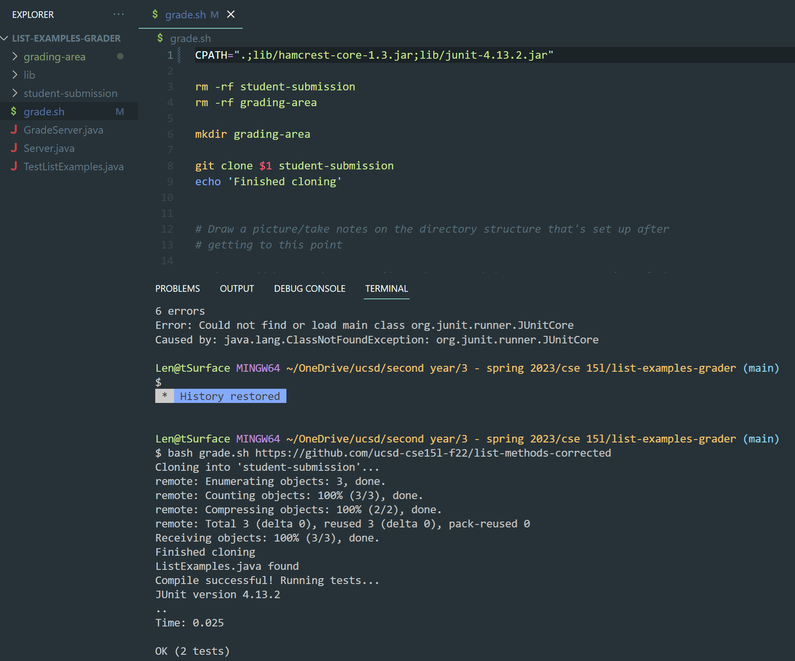

# Lab Report 5
**Student:**

Using my local computer, Windows OS, running in VS Code.
I'm trying to test my grade.sh file against the corrected list methods repository from Week 6, but I'm running into compiling errors.
Since that repository has the corrected methods, I know the repository itself is fine and should run and pass all of the tests.
I'm guessing the bug has something to do with JUnit, since it says the JUnit package doesn't exist. But I checked that I imported it, 
and I copied the lib folder into the working directory so all of the files should be there.

**TA:**

I see that you're running this program on your local computer. Since you forked this repository from the one given in lab, I'd suggest
trying to run your program with the same student-submission repository on the remote server. If it runs remotely but not locally,
try to think about what commands the remote server uses for JUnit, and how this may differ from your local computer.


**Student:**

After trying your suggestion, I found that my grade.sh compiled when running on the remote server. I went back to Week 3 to read more on running JUnit tests, and remembered that there are different commands for Windows and Mac. Since the remote server uses the Mac command, that must be why the CPATH variable was not working for me when I forked it from the repository. After changing it to the Windows command, I tried running it locally again and it worked. Thanks for your help!

## Setup
**File and Directory Structure:**
* Forked repository of https://github.com/ucsd-cse15l-s23/list-examples-grader
* Used https://github.com/ucsd-cse15l-f22/list-methods-corrected as the student-submission

**Contents of Files Before Debugging:**
* TestListExamples.java

```
import static org.junit.Assert.*;
import org.junit.*;
import java.util.Arrays;
import java.util.List;
import java.util.ArrayList;

class IsMoon implements StringChecker {
  public boolean checkString(String s) {
    return s.equalsIgnoreCase("moon");
  }
}

public class TestListExamples {
  @Test(timeout = 500)
  public void testMergeRightEnd() {
    List<String> left = Arrays.asList("a", "b", "c");
    List<String> right = Arrays.asList("a", "d");
    List<String> merged = ListExamples.merge(left, right);
    List<String> expected = Arrays.asList("a", "a", "b", "c", "d");
    assertEquals(expected, merged);
  }
  @Test
  public void testFilter() {
      StringChecker longerThan3 = new LongerThan3();
      List<String> input = new ArrayList<>();
      input.add("cat");
      input.add("giraffe");
      input.add("dog");
      input.add("turtle");
      List<String> output = new ArrayList<>();
      output.add("giraffe");
      output.add("turtle");
      List<String> inputFiltered = ListExamples.filter(input, longerThan3);
      assertArrayEquals(output.toArray(), inputFiltered.toArray());
  }
}

class LongerThan3 implements StringChecker {
  public boolean checkString(String s) {
      return s.length() > 3;
  }
}
```

* grade.sh

```
CPATH='.:lib/hamcrest-core-1.3.jar:lib/junit-4.13.2.jar'

rm -rf student-submission
rm -rf grading-area

mkdir grading-area

git clone $1 student-submission
echo 'Finished cloning'


# Draw a picture/take notes on the directory structure that's set up after
# getting to this point

# Then, add here code to compile and run, and do any post-processing of the
# tests

if [[ -f student-submission/ListExamples.java ]]
then
    echo "ListExamples.java found"
else
    echo "ListExamples.java not found"
fi 

cp student-submission/ListExamples.java grading-area
cp TestListExamples.java grading-area
cp -R lib grading-area


cd grading-area
javac -cp $CPATH *.java 2>error-output.txt

if [[ $? -ne 0 ]]
then
    echo "Could not compile!"
    cat error-output.txt
else
    echo "Compile successful! Running tests..."
fi


javac -cp $CPATH *.java 2>error-output.txt
java -cp $CPATH org.junit.runner.JUnitCore TestListExamples
```

* All other files were kept the same.

**Commands:**

`$ bash grade.sh https://github.com/ucsd-cse15l-f22/list-methods-corrected`

**To fix the bug:**

Change the CPATH variable to `".;lib/hamcrest-core-1.3.jar;lib/junit-4.13.2.jar"` for running on Windows

---
## Reflection
One thing I learned from the second half of this quarter was writing bash scripts and what they are used for. After learning about the commands to run JUnit tests, I was quickly finding it tedious to copy and paste the commands every time I needed to run the tests again. However, bash commands were soon introduced and I thought the whole concept of them was so convenient. I think it's cool how they can be used to run autograders, and it was interesting to experience some of the work behind making an autograder.
